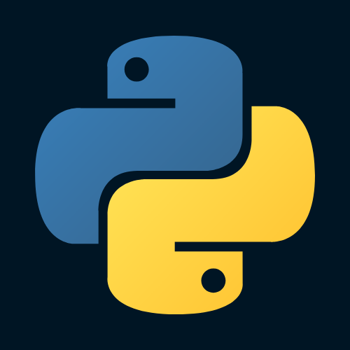
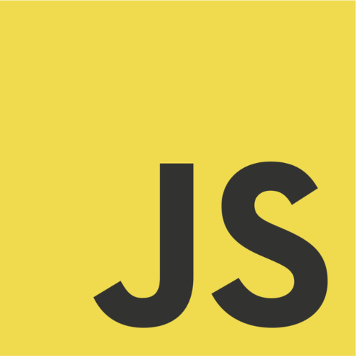
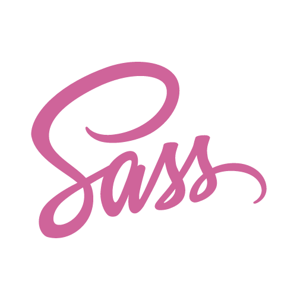

<head style="color: white">
  <h1>Opa eae, Baum?</h1>
  <h1>Eu sou o João Victor 👋</h1>

  <ol>
    <li>
      <strong>Estudos</strong>
      
🌱 Sou estudante de Ciência da Computação na Universidade Federal de Viçosa.

    </li>
    <li>
      <strong>Sobre Mim </strong>
      
👻 Amo filmes de terror e adoro jogar xadrez. 

    </li>
    <li>
      <strong>Interesses</strong>
      
⚙️ Tenho interesse em Engenharia de Software e metodologias ágeis. 

    </li>
    <li>
      <strong>Estudando</strong>
      
📚 Estou estudando React, Next e desenvolvimento web.

    </li>
    </li>
  </ol>
</head>
  

 
  
  
  
  
  
  
  
  
  
  
  
  

  
##
